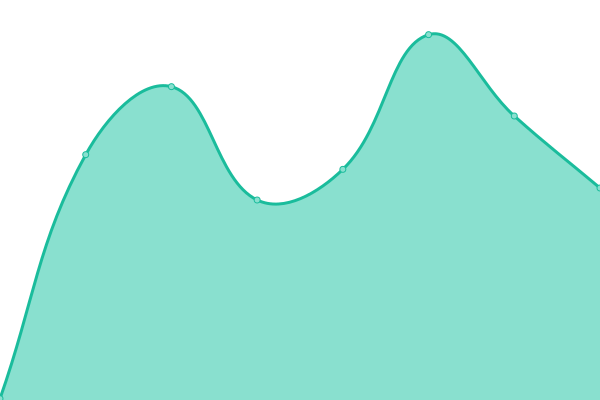
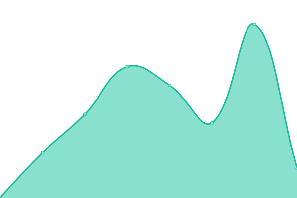

# [📈 Live Status](https://demo.upptime.js.org): <!--live status--> **🟧 Partial outage**

This repository contains the open-source uptime monitor and status page for [Alluvial](https://alluvial.finance), powered by [Upptime](https://github.com/upptime/upptime).

With [Upptime](https://upptime.js.org), you can get your own unlimited and free uptime monitor and status page, powered entirely by a GitHub repository. We use [Issues](https://github.com/alluvialfinance/upptime/issues) as incident reports, [Actions](https://github.com/alluvialfinance/upptime/actions) as uptime monitors, and [Pages](https://demo.upptime.js.org) for the status page.

<!--start: status pages-->
<!-- This summary is generated by Upptime (https://github.com/upptime/upptime) -->
<!-- Do not edit this manually, your changes will be overwritten -->
<!-- prettier-ignore -->
| URL | Status | History | Response Time | Uptime |
| --- | ------ | ------- | ------------- | ------ |
|  [Alluvial API](https://api.alluvial.finance) | 🟩 Up | [alluvial-api.yml](https://github.com/AlluvialFinance/upptime/commits/HEAD/history/alluvial-api.yml) | 

 352ms
     
 | 

<a href="https://status.alluvial.finance/history/alluvial-api">100.00%</a>
    

|  [Alluvial Staging](https://api.staging.alluvial.finance) | 🟩 Up | [alluvial-staging.yml](https://github.com/AlluvialFinance/upptime/commits/HEAD/history/alluvial-staging.yml) | 

 308ms
     
 | 

<a href="https://status.alluvial.finance/history/alluvial-staging">100.00%</a>
    

|  [Liquid Collective DApp](https://dapp.alluvial.finance) | 🟥 Down | [liquid-collective-d-app.yml](https://github.com/AlluvialFinance/upptime/commits/HEAD/history/liquid-collective-d-app.yml) | 

 0ms
     
 | 

<a href="https://status.alluvial.finance/history/liquid-collective-d-app">2.91%</a>
    

|  [Liquid Collective Website](https://liquidcollective.io) | 🟩 Up | [liquid-collective-website.yml](https://github.com/AlluvialFinance/upptime/commits/HEAD/history/liquid-collective-website.yml) | 

 390ms
     
 | 

<a href="https://status.alluvial.finance/history/liquid-collective-website">100.00%</a>
    

|  [Alluvial Website](https://alluvial.finance) | 🟩 Up | [alluvial-website.yml](https://github.com/AlluvialFinance/upptime/commits/HEAD/history/alluvial-website.yml) | 

 293ms
     
 | 

<a href="https://status.alluvial.finance/history/alluvial-website">100.00%</a>
    

<!--end: status pages-->

[**Visit our status website →**](https://demo.upptime.js.org)

## 📄 License

- Powered by: [Upptime](https://github.com/upptime/upptime)
- Code: [MIT](./LICENSE) © [Alluvial](https://alluvial.finance)
- Data in the `./history` directory: [Open Database License](https://opendatacommons.org/licenses/odbl/1-0/)
